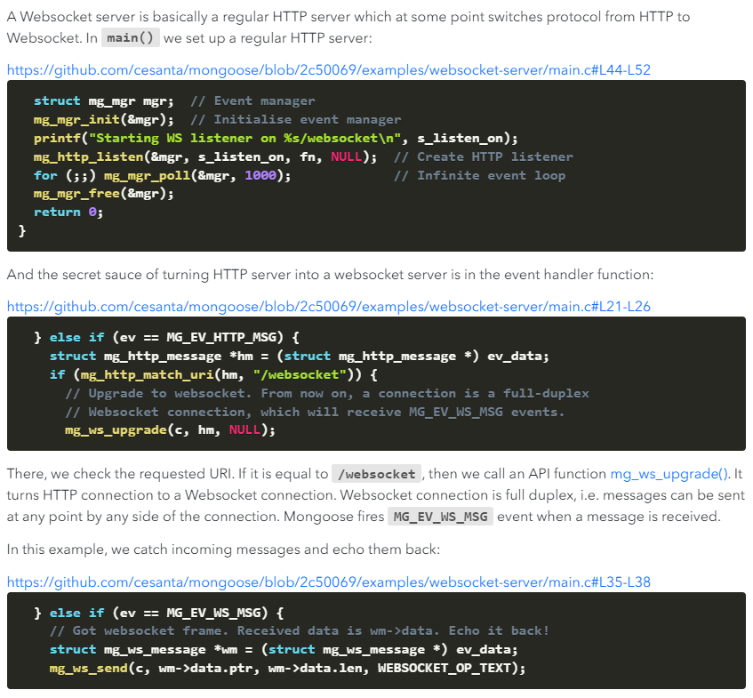
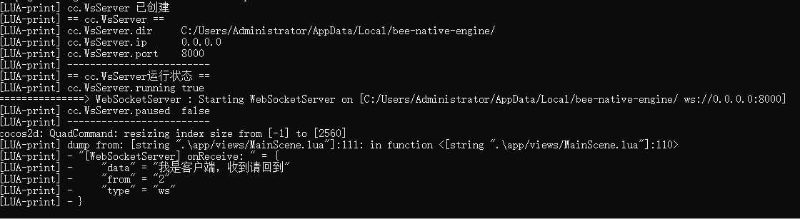
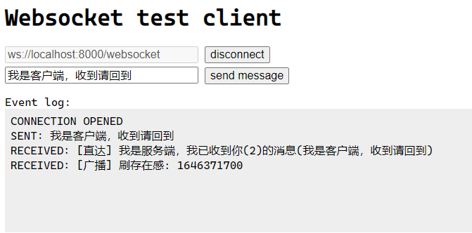

# cocos2d-x-lws

## 一、介绍

**cocos2d-x-lws** 在 **[cocos2d-x-lhs](https://github.com/DoooReyn/cocos2d-x-lhs)** 的基础上增加了对 WebSocket 的支持，可以成为在 `Cocos2d-x` 中内嵌 **WebSocket 本地服务器** 的一个方案。借助 WebSocket 服务器的便利，将 2d-x 的可读写目录通过 WebSocket 服务器暴露出来，就可以实现 Js 和 C++/Lua 的交互，从而可以做一些有趣的事情，比如说：

-   在可读写目录放一个静态页面，在 js 脚本中开启一个 WebSocket 客户端，配合 webview 非常适合：
    -   做可交互的动态活动页面
    -   甚至可以内嵌可交互的小游戏

## 二、实现

**cocos2d-x-lws** 将 [mongoose](https://mongoose.ws/) 作为内嵌 webSocket 服务器，根据官网介绍：

>     Mongoose is a networking library for C/C++. It implements event-driven, non-blocking APIs for TCP, UDP, HTTP, WebSocket, MQTT. It connects devices and brings them online. Since 2004, a number of open source and commercial products have utilized it. It even runs on the International Space Station! Mongoose makes embedded network programming fast, robust, and easy.

可见它的使用场景相当丰富，而 WebSocket server 只是它的冰山一角。

而且，移植也相当简单，只要引入 `mongoose.h/mongoose.c` 即可，附[下载地址](https://github.com/cesanta/mongoose/releases)。

接着根据文档，找到创建 WebSocket server 示例：



可以知道，创建一个 WebSocket server 需要三个要素：

-   监听目录
-   监听主机 IP
-   监听端口

我们进行封装的时候可以把它们提取出来作为参数传入，比如：`new WebSocketServer(dir, ip, port)`。

同时，由于 WebSocket 是在 HTTP 协议上进行升级，因此它同样天生具备作为 HTTP 服务器的任何条件，换句话说，你也可以把它当作是一个 HTTP 服务器。

再者，由于我们需要跟 Lua 交互 _（即把消息转发给 Lua）_，因此还需要支持传入一个 Lua 方法：`setLuaListener`。

考虑到 WebSocket 具备全双工特性，因此我们还需要支持消息接收和发送，其中发送还需要支持：

-   指定的客户端 `sendTo`
-   广播给所有人 `broadcast`

考虑到易用性，我们还需要扩展几个基础接口：

-   开启 `start`
-   关闭 `shutdown`
-   暂停 `pause`
-   恢复 `resume`
-   状态
    -   运行中 `running`
    -   已暂停 `paused`

另外，需要注意的是：由于 `mongoose` 内部实现了事件循环，也就是 `Event loop` 部分，因此需要将这部分代码放在线程中执行，否则会阻塞 `2d-x` 主程序。

## 三、使用

上述的接入过程这边已经搞定了，并且还贴心地给各位准备了 `Lua Binding` 接口，大家可以放心食用，只需要稍微动下你的手指 _(顺便点个 [Star](https://github.com/DoooReyn/cocos2d-x-lws))_：

1. 将 `Classes` 下文件导入 `Cocos2d-x` 工程
2. 在 `AppDelegate.cpp` 中引入 `lua-websocket-server.h`
3. 在 `applicationDidFinishLaunching` 中调用 `lua_module_register_websocket_server(L)` 注册即可

以下是在 Lua 层运行的测试的用例：

```lua
function startWebSocketServer()
    -- WebSocketServer指定的监听目录
    local server_dir = cc.FileUtils:getInstance():getWritablePath()

    -- WebSocketServer指定的IP，不填默认本机
    local server_ip = ''

    -- WebSocketServer指定的端口，默认16999
    local server_port = '8000'

    local server = cc.WsServer:create(server_dir, server_ip, server_port)
    if tolua.isnull(server) then
        print('cc.WsServer 创建失败')
        return
    end
    print('cc.WsServer 已创建')
    server:setLuaListener(
        function(dict)
            dump(dict, '[WebSocketServer] onReceive: ')
            if dict and dict.type == "ws" then
                local msg = string.format("[直达] 我是服务端，我已收到你(%s)的消息(%s)", dict.from, dict.data)
                server:sendTo(dict.from, msg)
            end
            server:broadcast("[广播] 刷存在感: " .. os.time())
        end
    )

    -- 输出WebSocketServer基础信息
    print('== cc.WsServer ==')
    print('cc.WsServer.dir ', server:dir())
    print('cc.WsServer.ip  ', server:ip())
    print('cc.WsServer.port', server:port())
    print('-------------------------')

    -- 启动WebSocketServer，此时网页可以访问了
    server:start()

    -- 查看WebSocketServer运行状态
    print('== cc.WsServer运行状态 ==')
    print('cc.WsServer.running', server:running())
    print('cc.WsServer.paused', server:paused())
    print('-------------------------')
end
```

-   运行结果



-   WebSocket server 视图


